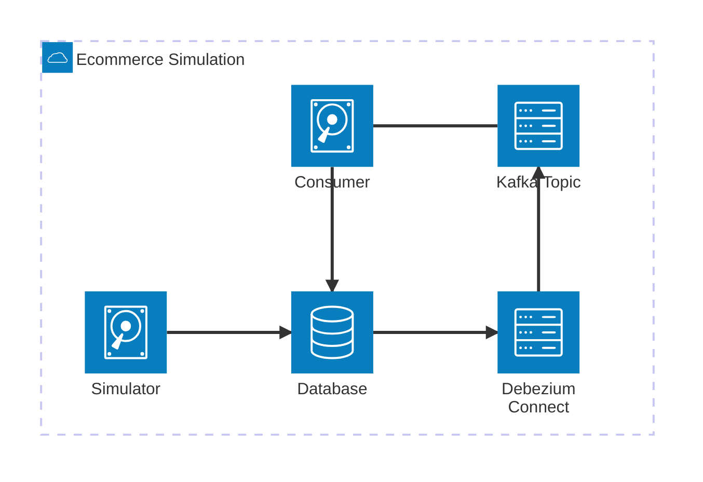

# RetentionCast - Real-time E-commerce Analytics using Change Data Capture

Built using: Python, Postgres, Kafka, Debezium

RetentionCast is a scalable, performant streaming, real-time analytics architecture intended to provide up-to-date predictions on when a customer is likely to be at-risk of churning based on their activity.

I was a big fan of [lifetimes](https://github.com/CamDavidsonPilon/lifetimes), before it was archived. [PyMC-Marketing](https://github.com/pymc-labs/pymc-marketing) has incorporated its functionality, but this project was in part an excuse to go deeper on the basic workings of the library, as I reimplement from scratch some of the algorithms it uses.

## Architecture

This project uses Debezium to implement a Change Data Capture model. The idea is that as web shop activity happens it causes transactions to be inserted into the database. Those changes are then streamed into a Kafka topic by Debezium, and the consumer can operate on each individual change (in this case to calculate and update a table used to calculate churn likelihood)

The Simulator generates sales transactions to insert into the database. It's a simple script that creates random transactions and randomly causes the user who purchased to maybe churn.

The Consumer reads sale transactions from Kafka and either creates a new entry in the analytics table (Recency, Frequency & Monetary Value) table for that user or updates their entry. This table is used to calculate churn for users, and the store overall.

Survival analysis for churn can be done using SQL, as detailed [here](https://www.crosstab.io/articles/sql-survival-curves/)

### Analytics table schema

- first_purchase - time the customer was first seen
- latest_purchase - time the customer made their most recent purchase
- recency - the age of the customer when they made their most recent purchase, equal to the duration between their first purchase and their latest purchase
- frequency - number of repeat purchases (one less than total purchases)
- order_count - number of orders
- order_value - total order value

### Advantages of this approach

- A scalable, performant real-time architecture
- An approach to churn that is very flexible and derived from customer activity, but can support business-led churn definitions (i.e. "if we haven't seen someone in 30/60/90 days we count them as churned") as well.

### Disadvantages of this approach

- More difficult and time-consuming to manage than a batch architecture, a trade-off that only makes sense at a significant scale and if this service is a significant focus for the business.
- Potentially more difficult to debug and fix errors in production
- [Real-time is a seductive concept but should be carefully applied](https://mcfunley.com/whom-the-gods-would-destroy-they-first-give-real-time-analytics)

## Progress

- TODO: Blogpost
- TODO: documentation
- TODO: Performance benchmarks
- TODO: Deployment guides
- TODO: Example use cases

## Running

    docker compose up
    ./setup.sh
